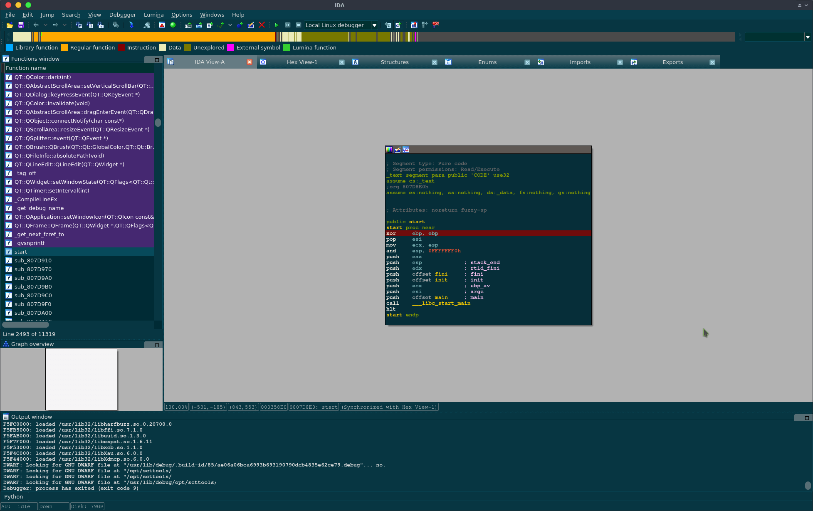
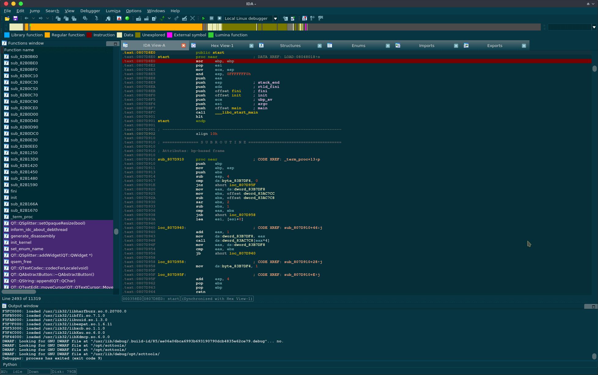
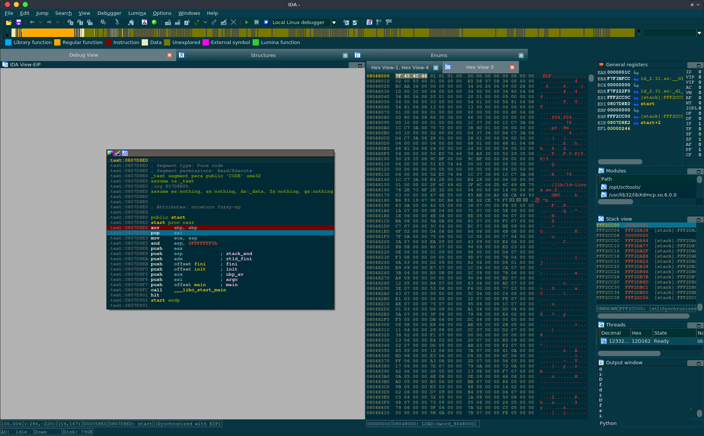
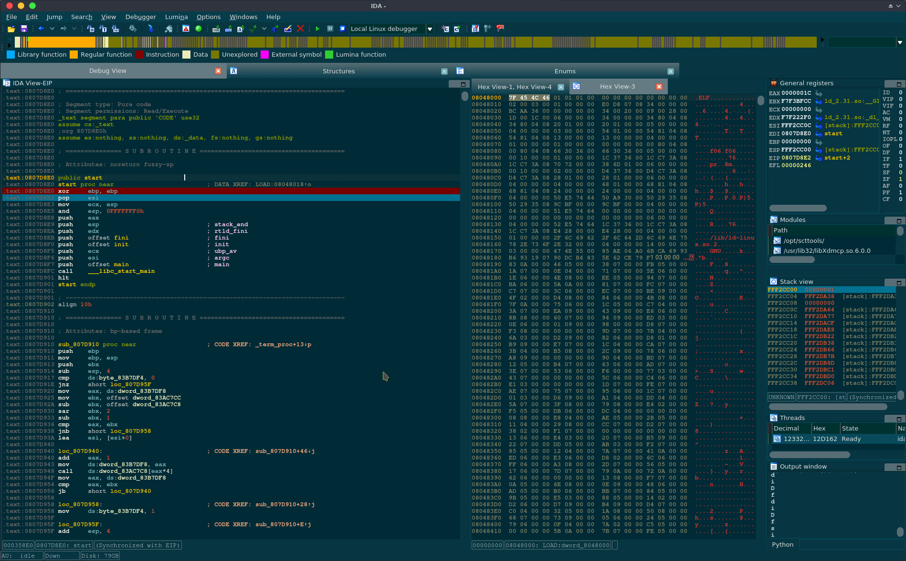
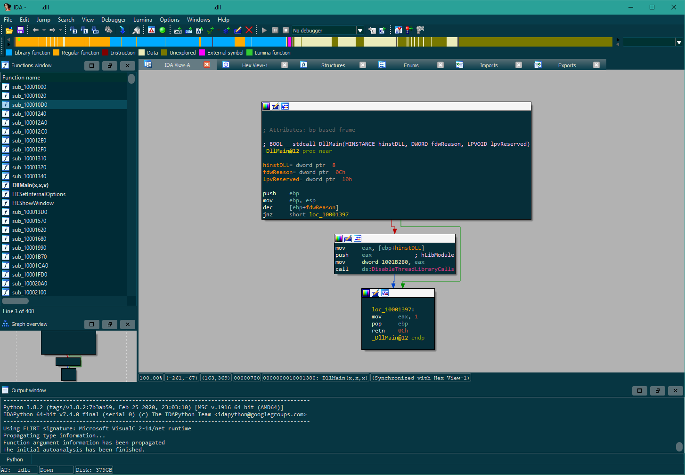
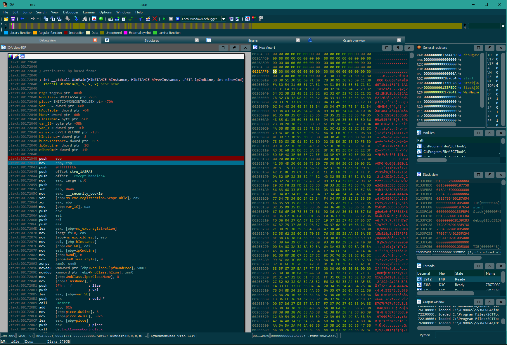
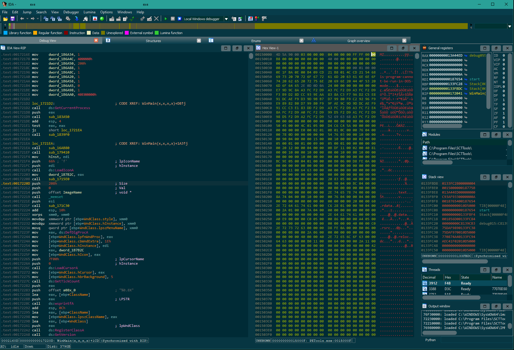
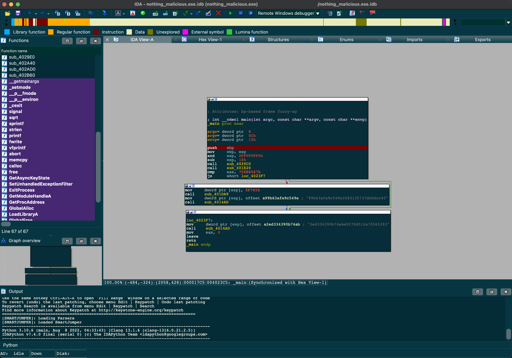
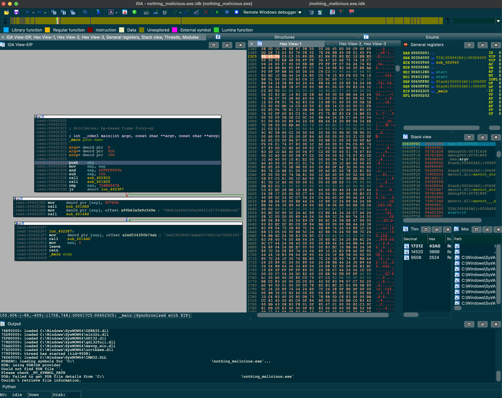
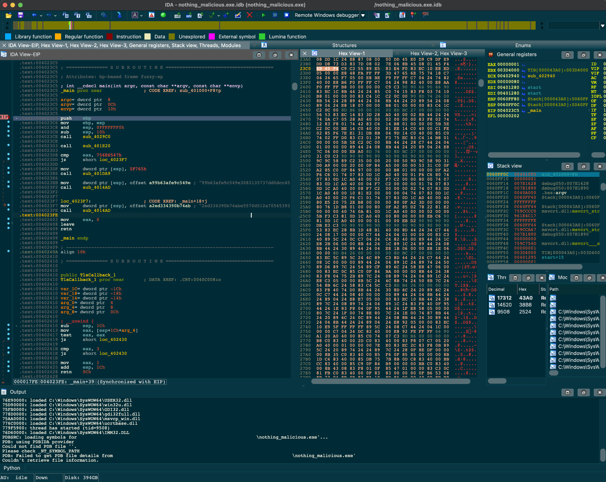

# IDA Pro Solarized Theme

[Türkçe](README-TR.md) Okubeni için tıklayınız.

Solarized Theme for IDA Pro 7.3+

The color scheme `Solarized Dark` is from [Ethan Schoonover](https://github.com/altercation): https://github.com/altercation/solarized<br />
Theme is also based on [ida-skins](https://github.com/zyantific/IDASkins.git) theme by [Zyantific](https://github.com/zyantific/IDASkins.git)

## Installation

Just put the `solarized-dark` directory under `<your-ida-path\themes>` for system-wide accesibility.

OR

Install, only for WINDOWS user:
```
%APPDATA%\Hex-Rays\IDA Pro\themes
```

Install, only for LINUX/MACOS user:
```
~/.idapro/themes
```


## Screenshots
### Linux :





### Windows:





### macOS






## Todo
Prepare Solarized Light Theme!

## Authors

[Blue DeviL][web-bd] // [SCT][web-sct]  

```json
{
"e-mail" : "bluedevil.SCT@gmail.com",
"twitter": "@bluedevilSCT"
"ICQ"    : 82503282
}
```

## License

This project is under the MIT License.


[web-bd]:  https://gitlab.com/bluedevil
[web-ei]:  https://gitlab.com/error.inside
[web-sct]: http://www.sctzine.com
